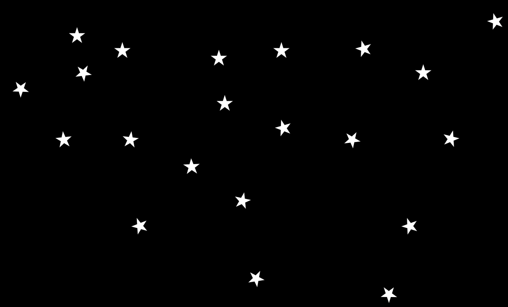
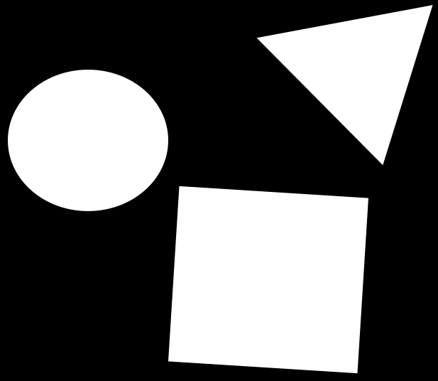
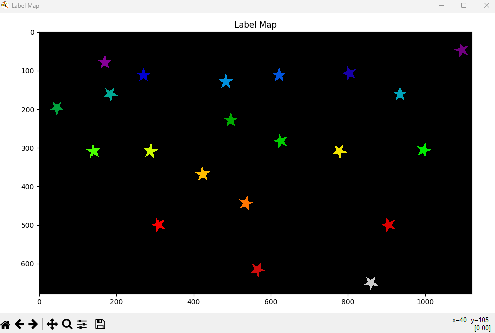
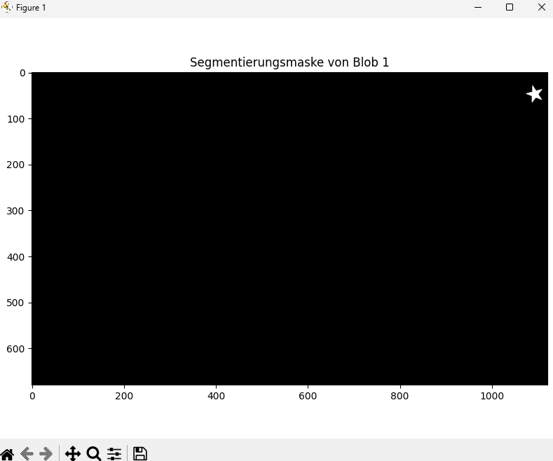

# 🌌 Region Growing – Automatic Star Labeling (Image Segmentation with Python)

This project implements an image processing routine to automatically label segmented objects (blobs) in an image.

The goal is to detect, label, and individually visualize stars in the input image `stars.png` using a simplified **Region Growing** algorithm based on **Flood Fill**.

---

## 🔧 Tech Stack & Methods

- **Python** · **NumPy** · **Matplotlib** · **Scikit-Image**
- Flood Fill (Region Growing)  
- Binary segmentation & labeling  
- Interactive visualization

---

## 📌 Features

- Load and convert RGB images to grayscale
- Automatically compute threshold for binarization
- Detect connected regions (stars) using `skimage.segmentation.flood()`
- Assign unique labels to each blob (star)
- Visualize all stars in color using `nipy_spectral`
- Show individual binary masks for each detected star (one per window)
- Interactive hover: Display blob ID when cursor is near a star
- Output number of detected stars in the console

---
## 🖼️ Output

Each detected star is assigned a unique label and color in the "Label Map".  
Individual binary masks are shown for further analysis or visualization.

---
## 📦 Dependencies

- `matplotlib`
- `numpy`
- `scikit-image`

Install with:

```bash
pip install matplotlib numpy scikit-image
```
---
### 📸 Visual Overview

#### 🖼️ Input: Original Star Image

The script starts with this image of stars:



---

#### ⚫ Binary Segmentation (Thresholding Step)

After grayscale conversion and thresholding, the image is binarized:  
This mask (`segmentation_mask.png`) highlights bright areas that may contain stars.



---

#### 🌈 Labeled Output – Region Growing (Flood Fill)

The Flood Fill algorithm assigns a unique label to each connected region.  
This is visualized using a color-coded Label Map:



---

#### 🔎 Example: Binary Mask of a Single Star

Each detected star (blob) is visualized in its own grayscale binary mask.

Example – Blob 1:



---

## 📄 License
This project was developed as part of a university project at FHNW and is intended for demonstration and educational purposes only.

---